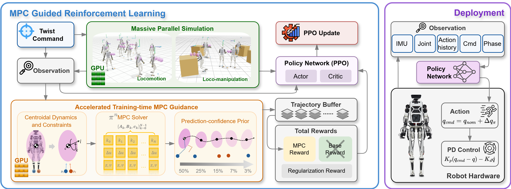
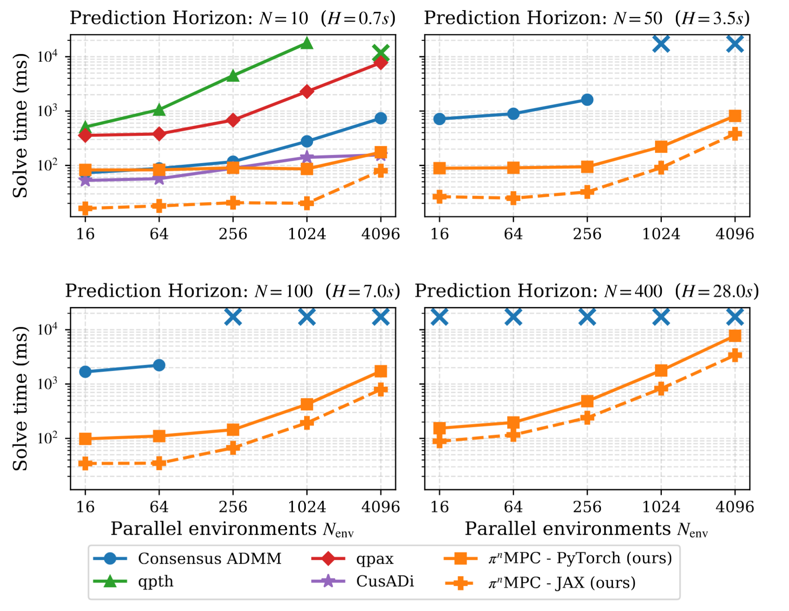

# Training-time MPC Guidance in Reinforcement Learning for Humanoid Loco-Manipulation

<p align="center">
  <a href="https://arxiv.org/abs/2606.05687"><b>Accelerating and Scaling MPC-Guided Reinforcement Learning for Humanoid Locomotion and Manipulation</b></a>
  <br>
  Junheng Li · Liang Wu · Sergio A. Esteban · Lizhi Yang · Ján Drgoňa · Aaron D. Ames
  <br>
  <a href="https://arxiv.org/abs/2606.05687">arXiv:2606.05687</a>
</p>

<p align="center">
  
</p>

Humanoid locomotion and manipulation RL, guided at training time by a **GPU-batched centroidal
model-predictive controller (MPC)**, solved in parallel by **$\pi^n$ MPC**.

A centroidal QP-MPC is solved for every environment at the policy rate. Its
optimal plan — CoM and momentum trajectory, ground-reaction forces, foot
placements, and (for manipulation) hand push forces — is fed into the RL
environment to shape the reward and inform the critic. The policy therefore
learns to *track an optimal model-based plan* rather than to discover dynamic
locomotion and manipulation from scratch.

<p align="center">
  
</p>

This repository contains only the training environments, the MPC, and the
proposed batch MPC solver **$\pi^n$ MPC** in JAX and PyTorch.

## Tasks

| Task ID | Description |
|---|---|
| `Mjlab-MPC-Guided-Locomotion-Themis` | MPC-guided velocity locomotion on flat terrain. |
| `Mjlab-MPC-Guided-Loco-manipulation-Themis` | MPC-guided loco-manipulation — walking and pushing a box. |

## Setup

Requires Python 3.11–3.13 and a CUDA 12 GPU.

```bash
uv sync
```

This installs everything: `mjlab` (MuJoCo / `mujoco-warp` / PyTorch / `rsl_rl`),
`scipy`, and `jax[cuda12]` for the JAX PiMPC solver.

## Training

Trained with mjlab's `train` entry point and 4096 parallel environments:

```bash
# Locomotion
CUDA_VISIBLE_DEVICES=0 uv run train Mjlab-MPC-Guided-Locomotion-Themis \
  --env.scene.num-envs 4096 \
  --agent.max-iterations 15000

# Loco-manipulation
CUDA_VISIBLE_DEVICES=0 uv run train Mjlab-MPC-Guided-Loco-manipulation-Themis \
  --env.scene.num-envs 4096 \
  --agent.max-iterations 25000
```

Resume from a checkpoint (regex match on the run-directory timestamp; omit
`--agent.load-checkpoint` to take the latest):

```bash
CUDA_VISIBLE_DEVICES=0 uv run train Mjlab-MPC-Guided-Locomotion-Themis \
  --agent.resume True \
  --agent.load-run "2026-05-08_22-55-00" \
  --agent.load-checkpoint model_5000.pt
```

Play back a trained policy:

```bash
uv run play Mjlab-MPC-Guided-Locomotion-Themis --wandb-run-path <entity/project/run-id>
```

## MPC & solvers

The centroidal MPC lives in [`src/themis_mpc/`](src/themis_mpc/): `CentroidalMPC`
(locomotion) and `LocoManipMPC` (adds hand push-force variables). The QP is built
over a short horizon from a phase-driven contact schedule and solved **batched
across all environments in a single call**, selected per task via
`MPCConfig.solver_type`:

- **`jax_pimpc`** — $\pi^n$ MPC (parallel-in-horizon) compiled with JAX/XLA; the
  default for both tasks and the fastest at training scale.
- **`pimpc`** — the same $\pi^n$ MPC algorithm in PyTorch, more memory-efficient for lighter PC setups.
- **`admm`** — batched consensus-ADMM QP solver (PyTorch).

### Scalability of $\pi^n$ MPC

$\pi^n$MPC parallelizes the solve across **both** the prediction horizon and the
thousands of parallel environments, so a single batched call replaces 4096
sequential MPC solves. This is what makes running an MPC *inside* the RL loop
tractable.

<p align="center">
  
</p>

### Tuning MPC parameters

MPC parameters are set at two levels:

- **Per-task (horizon, solve rate, solver, robot/contact geometry)** — on the MPC
  command term in [`env_cfgs.py`](src/themis_training/env_cfgs.py): `mpc_dt`,
  `mpc_horizon`, `run_every_n_steps`, `solver_type`, `mass`, `gait_period`,
  `duty_factor`, `com_height` (plus, for loco-manipulation, `mu_hand`,
  `f_hand_max`, `R_f_hand`, `R_hand_balance`). Locomotion is configured in
  `_apply_mpc_grf_features` / `_apply_mpc_grf_v2_features`; loco-manipulation in
  the `LocoManipMPCCommandCfg(...)` block of
  `themis_loco_manip_mpc_push_box_flat_env_cfg`.
- **Cost weights, friction limits, and solver internals** — the `MPCConfig`
  dataclass in [`centroidal_mpc.py`](src/themis_mpc/centroidal_mpc.py) (and
  `LocoManipMPCConfig` in [`loco_manip_mpc.py`](src/themis_mpc/loco_manip_mpc.py)):
  tracking weights `Q_c` / `Q_l` / `Q_k`, terminal scale `Qf_scale`, input
  regularization `R_f_foot` / `R_tau_foot` / `R_delta`, friction `mu_foot` /
  `fz_max_foot` and foot geometry, and solver settings `admm_max_iter`,
  `pimpc_rho`, `pimpc_accel`, `pimpc_precondition`.

## Acknowledgements

This work builds on:

- [**mjlab**](https://github.com/mujocolab/mjlab) — MuJoCo-Warp GPU RL training
  framework (provides MuJoCo / `mujoco-warp` / `rsl_rl` and the `train`/`play`
  entry points).
- [**$\pi$-MPC**](https://github.com/SOLARIS-JHU/PiMPC.jl) — the Julia-based parallel-in-horizon
  MPC solving method for time-invariant mono. MPCs.

## Citation

If you find this work useful, please cite:

```bibtex
@article{li2026accelerating,
  title={Accelerating and Scaling MPC-Guided Reinforcement Learning for Humanoid Locomotion and Manipulation},
  author={Li, Junheng and Wu, Liang and Esteban, Sergio A and Yang, Lizhi and Drgo{\v{n}}a, J{\'a}n and Ames, Aaron D},
  journal={arXiv preprint arXiv:2606.05687},
  year={2026}
}
```
